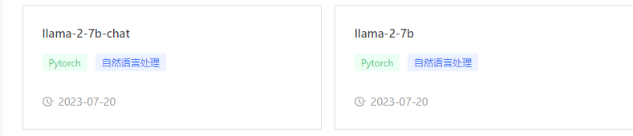

# LlaMa-2-7B\&LlaMa-2-7B-chat

### 模型介绍

### **LlaMa 2**

LlaMa 2 is a collection of pretrained and fine-tuned generative text models ranging in scale from 7 billion to 70 billion parameters. This is the repository for the 7B pretrained model. Links to other models can be found in the index at the bottom.


[LlaMa-2-7b-chat](https://www.lanrui-ai.com/index/model/detail?activeKey=filelist\&name=llama-2-7b-chat\&path=%2F\&version=436f7586-cac6-4185-88fd-ae02c8e1bc41)

[LlaMa-2-7b](https://www.lanrui-ai.com/index/model/detail?activeKey=filelist\&name=llama-2-7b\&path=%2F\&version=5e4c56e7-10fc-44d2-aa96-5369eca1467c)

<figure><figcaption></figcaption></figure>

### 启动方式

1. 创建工作空间，按需选择GPU资源
2. 挂载公有镜像pytorch: official-torch2.0-cu1117。选择预训练模型: llama-2-7b和llama-2-7b-chat
3. 创建工作空间

<figure><figcaption></figcaption></figure>

4. 创建完成后，打开vscode或jupyter，在终端中输入以下命令，可能需要[学术网站加速](../yong-hu-shou-ce/gao-ji-she-zhi/xue-shu-wang-zhan-jia-su.md)

```
cd /ark-contexts/imported_models

sudo git clone https://github.com/facebookresearch/llama.git

cd llama

sudo pip install -e .
```

<figure><figcaption></figcaption></figure>

5. 使用模型

LlaMa-2-7b

```
torchrun --nproc_per_node 1 example_text_completion.py \
--ckpt_dir ../llama-2-7b/Llama-2-7b/ \
--tokenizer_path ../llama-2-7b/Llama-2-7b/tokenizer.model \
--max_seq_len 128 --max_batch_size 4
```

LlaMa-2-7b-chat

```
torchrun --nproc_per_node 1 example_chat_completion.py \
--ckpt_dir ../llama-2-7b-chat/Llama-2-7b-chat/ \
--tokenizer_path ../llama-2-7b-chat/Llama-2-7b-chat/tokenizer.model \
--max_seq_len 512 --max_batch_size 4
```

