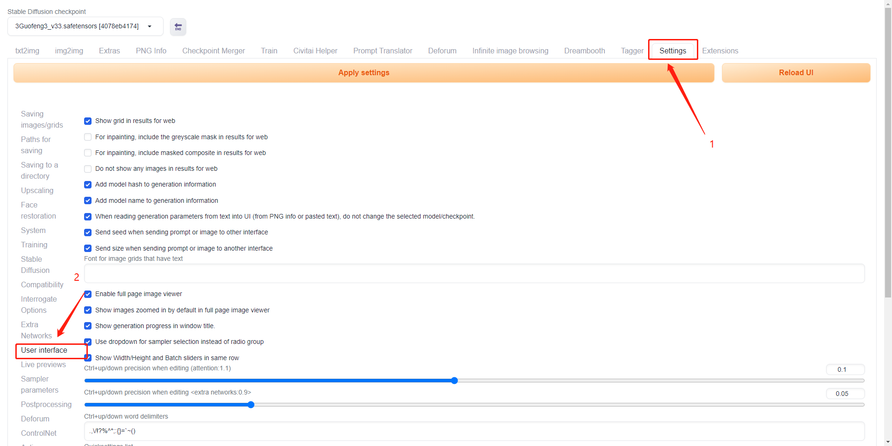
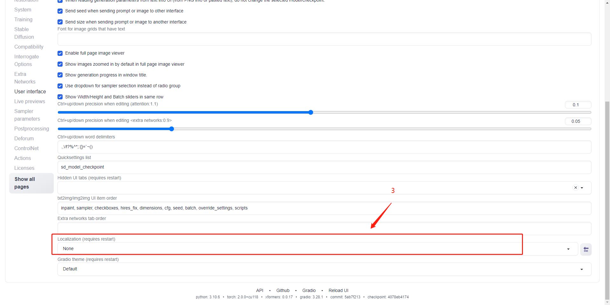
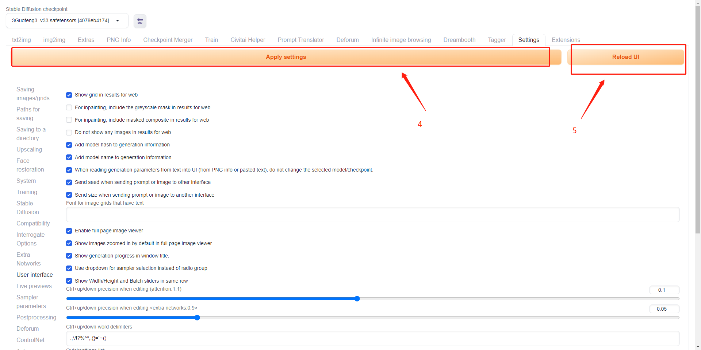

# 常见问题

## 平台使用类

1. 工作空间重启后，哪些数据会丢失，哪些不会？

重启后，/home/user/和/ark-contexts/data/目录下的数据不会丢失，其他数据会丢失

2. 为什么网盘中默认会有一个data文件夹？

网盘中的data文件夹是用户多个工作空间的共享目录，data文件夹下的任何数据，都可以在该可用区下的所有工作空间中使用

3. &#x20;为什么网盘速度比较慢？

&#x20;网盘底层使用了分布式文件系统，保证数据的可靠性。网盘非常适用于AI训练场景下大文件读写和小文件的读操作，但不适用于大量的小文件的写操作。

在这种场景下，请在启动工作空间时，使用数据盘功能。注意工作空间重启后，数据盘内容不会丢失。但释放工作空间后，数据盘内容会丢失。

4. 工作空间为什么启动会比较慢？

在资源紧张的情况下，会出现调度失败的情况，平台会尝试反复调度直到成功，但的确会出现工作空间启动速度缓慢的情况。

5. 发布数据集和模型，审批时间较长怎么办？

请联系平台运营小助手反馈，我们将加快审批速度。

6. 如何开发票？

平台当前无法在线审批发票，请联系平台运营小助手或者对应的商务开具发票。

7. 网盘大小是多少？

网盘理论上是无限大的，您无需担心扩容问题，我们会赠送您10G大小的空间，超过部分的收费策略参见[充值和计费](chong-zhi-he-ji-fei.md)

8. 平台没有我要的镜像，怎么办？

可以点击左侧导航栏-镜像-查看推送命令，[自定义镜像](https://app.gitbook.com/o/3anLE44KR7QUl5PBlpaV/s/drI7ZQudK2Kwaximnqs7/\~/changes/87/yong-hu-shou-ce/gao-ji-she-zhi/zi-ding-yi-jing-xiang)


[自定义镜像](http://127.0.0.1:5000/s/drI7ZQudK2Kwaximnqs7/yong-hu-shou-ce/gao-ji-she-zhi/zi-ding-yi-jing-xiang)


9. 机器运行之前，拉取镜像的时间是否收费？

不收费。只有成功启动后，运行中状态才开始计费。如您发现有不正常的计费情况，可联系客服小助手解决。

10. 现在每个推理服务都是只能暴露一个端口给外部使用的对吧？

是的。

11. 网页端网盘上传文件很容易崩，怎么办？

大文件建议使用命令行上传。如果您对命令行不熟，也可以使用图形化客户端。参见[这里](zui-jia-shi-jian/shang-chuan-wang-pan-de-xiao-miao-zhao.md)。

12. 工作空间是否可以对外暴露端口？

可以，请参考[这里](gao-ji-she-zhi/she-zhi-gong-zuo-kong-jian-dui-wai-duan-kou.md)。但注意工作空间对外暴露端口一般适用于调试阶段，如需部署推理服务或者生产级别的Web Service，请使用平台的推理服务。

13. 平台是否支持外部的docker镜像？

暂不支持。可以将镜像push到平台的镜像仓库后使用。

14. 为什么工作空间SSH登录需要我输入密码？

需要您在设置-SSHKE中设置后，才能使用SSH免密登录。已经启动的工作空间需要重启后才能生效。&#x20;

## SD Web UI相关

1. 如何使用SD Web UI？教程


[Stable Diffusion Web UI的正确打开方式](http://127.0.0.1:5000/s/drI7ZQudK2Kwaximnqs7/yong-hu-shou-ce/zui-jia-shi-jian/stable-diffusion-web-ui-de-zheng-que-da-kai-fang-shi)


2. Reload UI 之后出现Bad Gateway

Reload后端会重启sd程序，需要手动刷新一下页面。

3. 如何在stable diffusion webUI中网盘地址是什么?（出现文件找不到的错误）&#x20;

工作空间和应用中的网盘地址都是/ark-contexts/data开头

4. 页面点击无反应？

刷新页面，若仍无反应重启程序（ctrl C断掉后重新运行程序，使用工作空间的适用） 若不能解决找客服。

5. 如何在webui中上传使用自己的模型？

&#x20;如您需要使用自己下载或训练的模型，仅需将模型放到网盘目录，【sd-webui-2.0：/data/sd/models/】【sd-webui-3.0：/data/sd-3/models/】下对应的目录内即可。&#x20;

注：由于网络问题，可能无法使用civiti helper插件

6. 如何安装扩展（extensions）？

&#x20;如果使用工作空间，可以直接在【sd-webui-2.0：“/ark-contexts/data/sd/extensions】【sd-webui-3.0：“/ark-contexts/data/sd-3/extensions】下git clone 或者，从本地上传到上述目录（插件生效，可能需要重启webui程序） 注：无法在页面上直接点install下载。

7. 能否在webui界面进行插件安装及检查更新

目前在webui界面进行插件安装及检查更新会导致应用针对插件逐个检查，但由于网络原因会连接失败。导致超时。若有插件安装需求，请参照上方说明进行安装。

8. 是否能切换为中文使用？

可以。请打开SD Web UI后前往setting-user interface，将localization 选择为chinese，点击apply settings, reload ui。设置完成后页面可能短暂不可用，请您等待几分钟后刷新页面。

<figure><figcaption></figcaption></figure>

<figure><figcaption></figcaption></figure>

<figure><figcaption></figcaption></figure>

8. 是否有更方便使用checkpoints, lora的方法？

webUI提供预览功能，您可按下图操作，随后点击相应图片使用。

<figure><figcaption></figcaption></figure>

