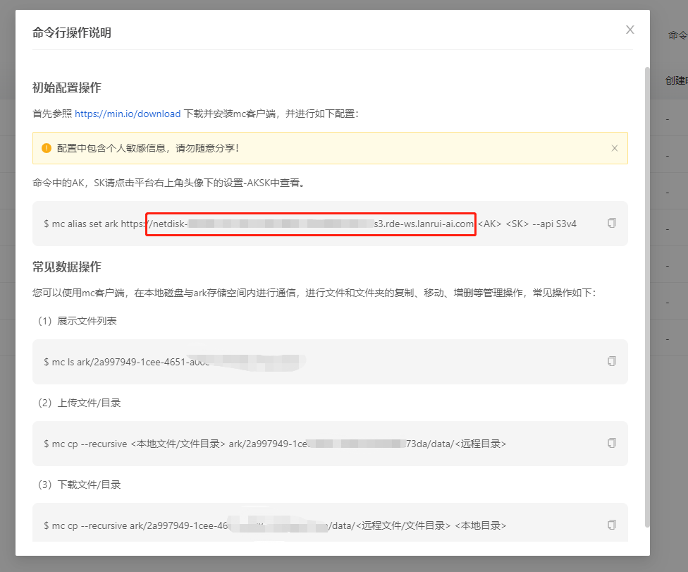
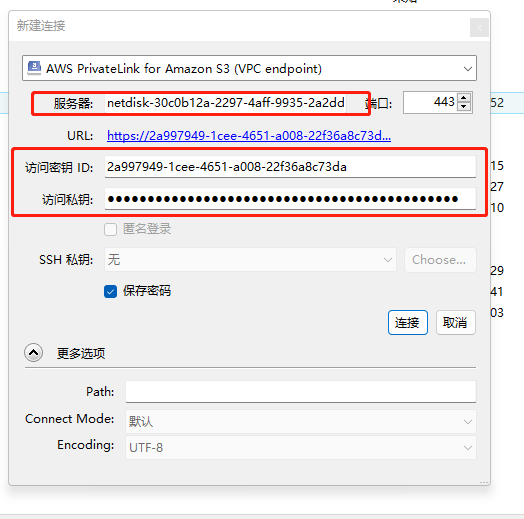

# 上传网盘的小妙招

使用网页上传和下载网盘文件有诸多不便，建议使用命令行操作。

<mark style="background-color:yellow;">注意：平台于2023.06.19进行了一次</mark>[<mark style="background-color:yellow;">网盘升级</mark>](../../geng-xin-ri-zhi.md)<mark style="background-color:yellow;">，升级后您可能需要更改网盘配置信息保证正常使用。</mark>

<figure><figcaption></figcaption></figure>

如果您对命令行不熟，可以使用客户端

## Windows版本

下载地址为：[https://pan.quark.cn/s/d0138cf1fd70](https://pan.quark.cn/s/d0138cf1fd70)

请注意，在不同可用区内网盘数据不互通，不同可用区内网盘gateway不同。

配置：需要进行如下设置：

* 进入cyberduck，点击新建连接，选择更多选项，搜索AWS并勾选AWS PrivateLink for Amazon S3.配置文件。

<figure><figcaption></figcaption></figure>

<figure><figcaption></figcaption></figure>

* 点击新建连接，选择AWS PrivateLink for Amazon S3。服务器输入下图中红线的内容（<mark style="background-color:yellow;">这个内容每个用户，每个可以区都不一样，请在揽睿星舟控制台-网盘-命令行操作中查看</mark>）。访问密钥ID和访问私钥分别是AK和SK。AK和SK的获取方式参考下图（在设置-AKSK中查看）

<figure><figcaption></figcaption></figure>

<figure><figcaption></figcaption></figure>

<figure><figcaption></figcaption></figure>

<figure><figcaption></figcaption></figure>

点击连接，即可进入网盘。自由访问，拖拽即可同步。

<figure><figcaption></figcaption></figure>

## Mac版本

下载地址：[https://pan.quark.cn/s/6ef156bc440b](https://pan.quark.cn/s/6ef156bc440b)

配置：需要进行如下设置：

* 点击新建连接，在协议中选择More Options，搜索aws，找到AWS PrivateLink for Amazon S3(VPC endpiont)并勾选。然后关闭后返回新建连接，在协议层选择刚才勾选到的AWS PrivateLink for Amazon S3(VPC endpiont)，服务器地址填写服务地址和AKSK（服务地址和AKSK的设置方式参见上文windows版本的设置）

<figure><figcaption></figcaption></figure>

<figure><figcaption></figcaption></figure>
