# 使用sd-trainer进行Lora训练

本教程介绍如何使用Stable Diffusion 训练 UI v1.3.1 by [秋葉aaaki](https://space.bilibili.com/12566101) 进行一个Lora模型的训练。


## SD-Trainer webui使用介绍

### 背景

SD-Trainer是stable diffusion进行lora训练的webui，LoRA，英文全称Low-Rank Adaptation of Large Language Models， 是微软的研究人员为了解决大语言模型微调而开发的一项技术。有了SD-Trainer，只需要少许图片，每个人都能够方便快捷地训练出属于自 己的stable diffusion模型，可以让图片按照你的想法进行呈现，例如下图所示，只需要4张柯基犬的高清图片，你就可以训练出一个lora 模型，让这个小可爱出现在丰富多彩的背景中。

<figure><figcaption></figcaption></figure>

SD-Trainer目前支持三种lora训练技术：lora/dylora/lycoris。仅需要单张3090和十来分钟，就可以完成训练。


### 使用步骤

#### 1. 登录揽睿星舟

登陆揽睿星舟账号：https://www.lanrui-ai.com/，如果还没有的话就在首页注册一个吧。

#### 2. 进入控制台

然后登陆进自己的账号，点击屏幕右上方进控制台。

<figure><figcaption></figcaption></figure>

#### 3. 创建工作空间

创建工作空间，按照以下内容配置

* 选择3090资源
* 镜像可选择平台提供的SD-TRAIN镜像，您可选择 公有镜像-others-sd-trainer-1.1.0
* 网盘：挂载
* 数据盘：建议使用

<figure>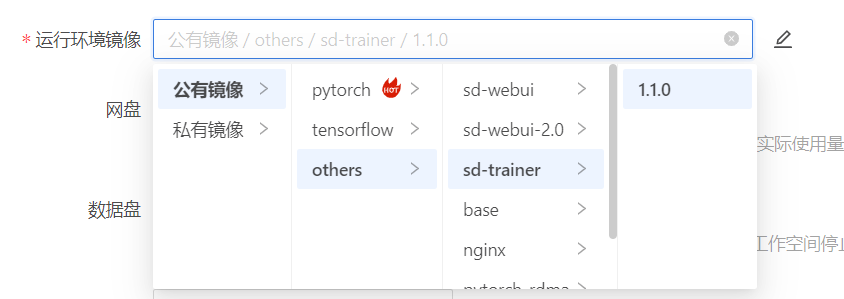<figcaption></figcaption></figure>

<figure>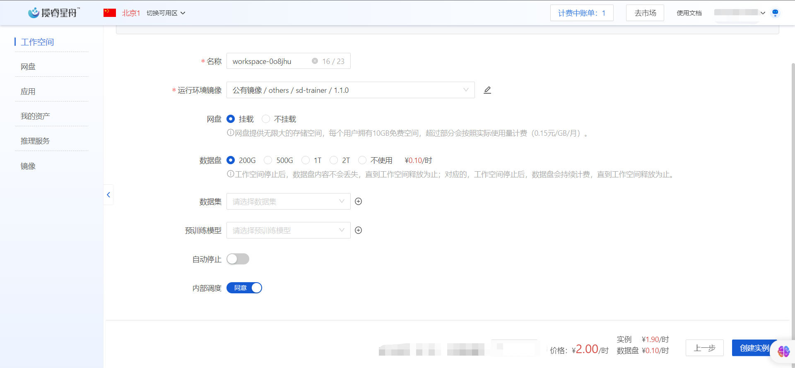<figcaption></figcaption></figure>

#### 4. 启动工作空间

点击启动工作空间，等待几分钟。启动完成后，点击进入，根据使用习惯选择你喜欢的ide，推荐vscode。

<figure>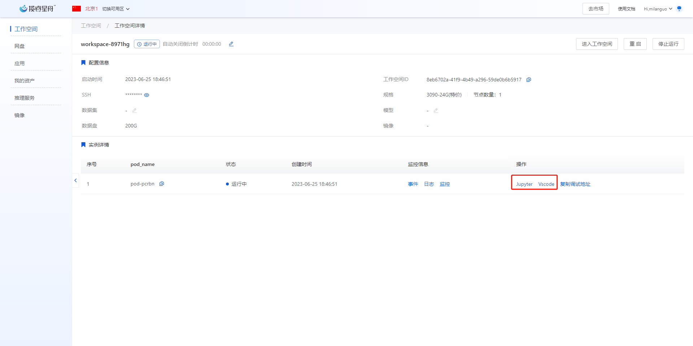<figcaption></figcaption></figure>

#### 5. 训练前准备

在工作空间中打开终端

<figure><figcaption></figcaption></figure>


**准备待训练数据集**

通常包含若干张待训练图片及其描述文字，本例中训练数据为huggingface网站上公开图片集： `https://huggingface.co/datasets/diffusers/dog-example/tree/main`。 为每张图片准备一段仅一行的文本描述，存入txt或caption文件。一张图片对应一个文本文件。描述文字的命名需和 图片一致，如`1.jpg`的描述文字为`1.caption`或`1.txt`。

&#x20;新建文件夹：

```
mkdir -p /ark-contexts/data/sd_train_dataset/img /ark-contexts/data/sd_train_dataset/log /ark-contexts/data/sd_train_dataset/model
```

在/ark-contexts/data/sd\_train\_dataset/img下新建"xx\_XXXXX"这种命名格式的目录，其中xx是数字，代表训练步数，XXXXX为自定义名称，本例中设为10\_item：

```
cd /ark-contexts/data/sd_train_dataset/img
mkdir 10_item
```

把准备好的训练数据放入上述文件夹。检查最终训练数据文件夹结构为:

```
sd_train_dataset
|-- model
|-- log
|-- img
|    |-- 10_item
|          |-- 1.jpg
|          |-- 1.caption
|          |-- 2.jpg
|          |-- 2.caption
|          |-- 3.jpg
|          |-- 3.caption
|          ......
```

**准备模型文件**

在本例中，你需要两部分模型文件，原始模型及clip模型。

原始模型（pretrained\_model）

对于原始模型，推荐从[https://huggingface.co/runwayml/stable-diffusion-v1-5](https://huggingface.co/runwayml/stable-diffusion-v1-5)中下载，存放路径就是后面的`pretrained_model_name_or_path`参数所填路径；&#x20;

<figure>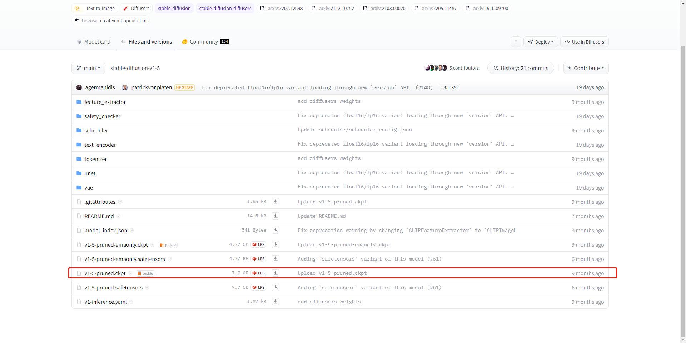<figcaption></figcaption></figure>


**CLIP模型**

在本例中，脚本里需要从openai/clip-vit-large-patch14下载模型文件，推荐从[`https://huggingface.co/openai/clip-vit-large-patch14`](https://huggingface.co/openai/clip-vit-large-patch14) 自行下载模型文件，上传到`/ark-contexts/data/huggingface/hub/models--openai--clip-vit-large-patch14/snapshots/8d052a0f05efbaefbc9e8786ba291cfdf93e5bff` 文件夹下。

**CLIP模型会在上述路径中默认读取，后续无需填写路径。**

检查最终文件夹结构为：

```
/ark-contexts/data/huggingface/hub/models--openai--clip-vit-large-patch14/snapshots
|-- 8d052a0f05efbaefbc9e8786ba291cfdf93e5bff
|    |-- config.json
|    |-- tokenizer.json
|    |-- tokenizer_config.json
|    |-- vocab.json
|    |-- pytorch_model.bin
|    ......
```

#### 6. 启动SD-Trainer

```
cd /app/lora-scripts
sudo sh run_gui.sh --host 0.0.0.0 --port 27777 --tensorboard-host 0.0.0.0
```

运行成功就可以使用了。

<figure>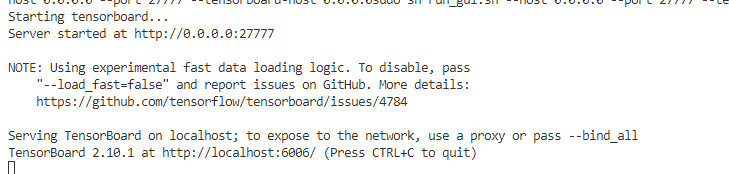<figcaption></figcaption></figure>

在工作空间中复制调试地址，在浏览器粘贴地址并跳转，就可以进入sd-trainer的页面。

<figure><figcaption></figcaption></figure>

<figure>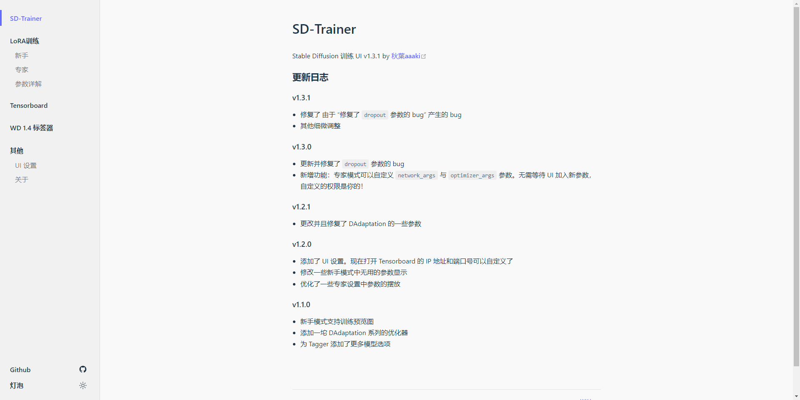<figcaption></figcaption></figure>

#### 7. 开始训练

在浏览器中粘贴地址并跳转，你会看到如下页面，可选择新手或专家两种模式，新手模式暴露的参数更少，如果对此流程不熟悉，推荐新手模式，本例中使用专家模式，可根据训练需要调整参数，其中路径类参数必须修改：

* 底模路径
* 训练数据集路径 /ark-contexts/data/sd\_train\_dataset/img
* 模型保存文件夹&#x20;
* 日志保存文件夹
*   tag文件扩展名：根据数据准备情况填写.caption或.txt

    <figure>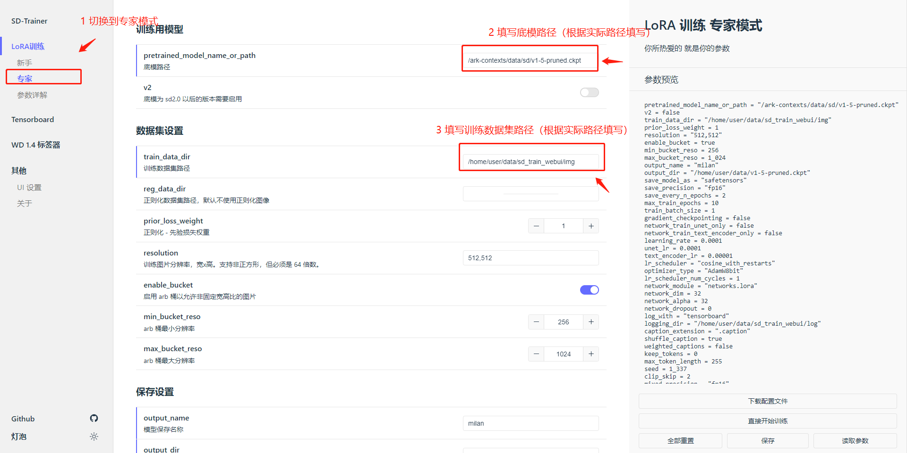<figcaption></figcaption></figure>

<figure><figcaption></figcaption></figure>

<figure>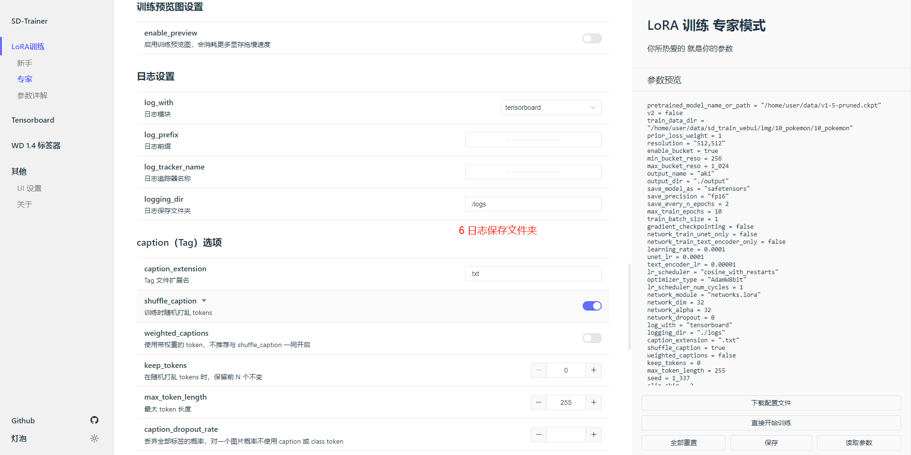<figcaption></figcaption></figure>

<figure>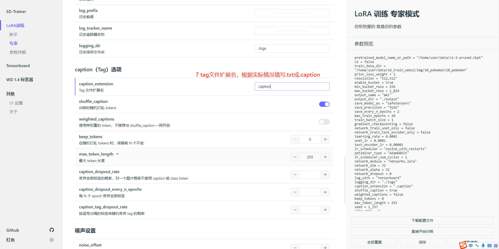<figcaption></figcaption></figure>

<figure><figcaption></figcaption></figure>

检查配置完成后，可点击“直接开始训练”，在您前面开启的终端中可监控模型训练结果


<mark style="background-color:yellow;">备注：如果出现训练失败，可以稍等一分钟，再重新点击开始训练。</mark>

<figure>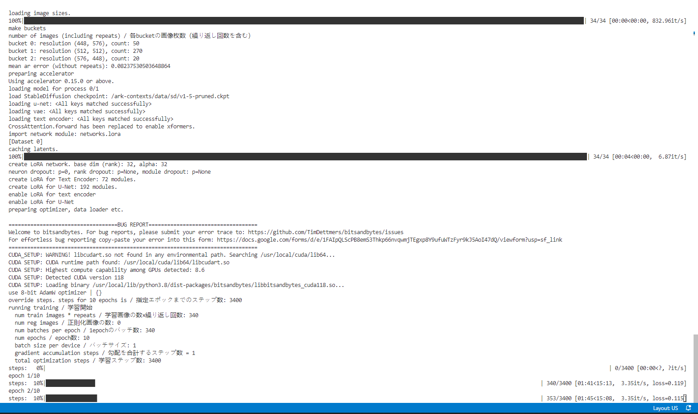<figcaption></figcaption></figure>

<figure>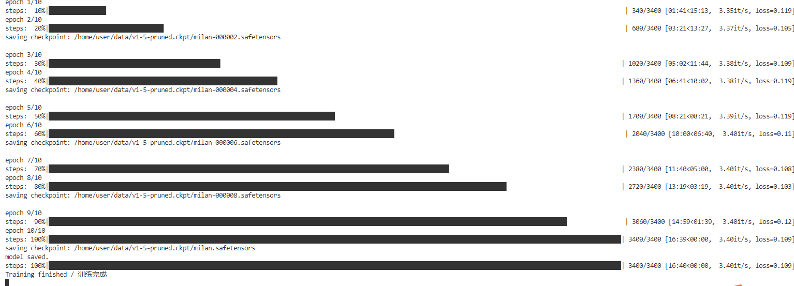<figcaption></figcaption></figure>


提示训练完成后，您就可以到模型保存路径找到您的模型，在[Stable Diffusion Web UI](stable-diffusion-web-ui-de-zheng-que-da-kai-fang-shi/)中使用啦
