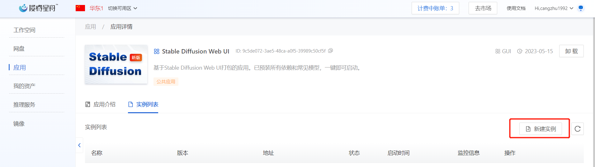
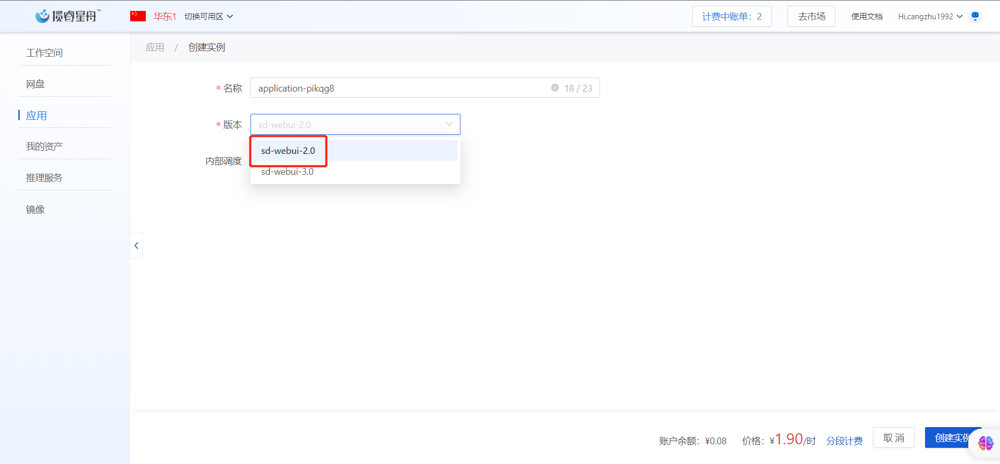
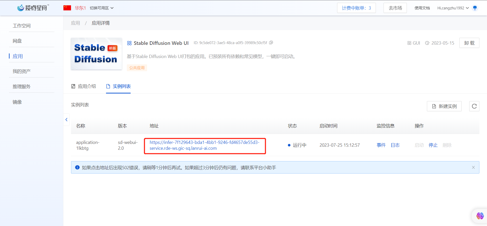

# Stable Diffusion Web UI v2.0 使用手册

**2023-07-12更新：目前平台更新了 Stable Diffusion Web UI v3.0，具体操作请参考**[**这里**](stable-diffusion-web-ui-v3.0-shi-yong-shou-ce.md)


平台提供两种方式打开Stable Diffusion Web UI v2.0，第一种是基于工作空间，第二种是基于应用。

## 基于工作空间

点击算力市场，购买一台3090的机器，镜像选择公共镜像/others/sd-webui-2.0/v3，网盘选择挂载，同时数据集选择sd-base，参见下图：

<figure><figcaption></figcaption></figure>

待实例状态为运行中后，进入Jupyter后，选择other下terminal， 运行如下命令。

```bash
// Some code
cd /app
bash start.sh
```

<figure><figcaption></figcaption></figure>

然后在实例-操作列中，复制调试地址，粘贴到浏览器后就能访问Stable Diffusion Web UI

<figure><figcaption></figcaption></figure>

## 基于应用

点击应用市场，找到Stable Diffusion Web UI 应用，点击使用

<figure><figcaption></figcaption></figure>

在应用详情页面，点击新建实例，无需修改任何参数，点击右下角的创建实例。待实例状态为运行中时，点击实例地址即可打开Web UI

<figure><figcaption></figcaption></figure>

在版本下拉框选择：sd-webui-2.0，开启Stable Diffusion Web UI v2.0

<figure><figcaption></figcaption></figure>

<figure><figcaption></figcaption></figure>

Stable Diffusion Web UI所使用的模型，会链接到网盘的data/sd目录下，用户可以直接在data/sd/models中上传模型，Web UI将会热加载新的模型，而无需重启。
