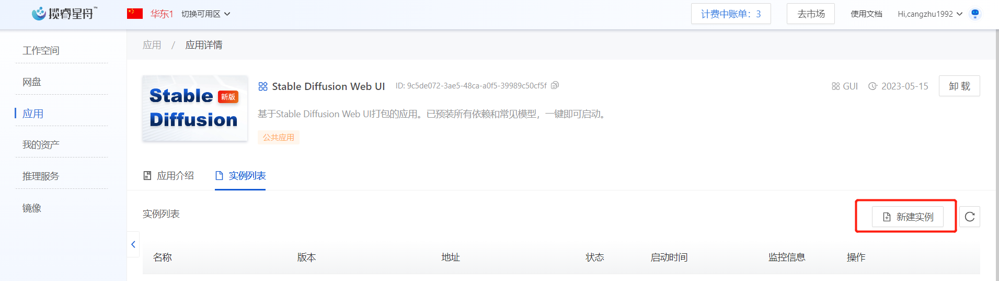

# Stable Diffusion Web UI v3.0 使用手册

**2023-07-17更新：目前平台更新了 Stable Diffusion Web UI v3.0（本篇内容），具体更新内容请参考看**[**最下方更新说明**](stable-diffusion-web-ui-v3.0-shi-yong-shou-ce.md#stablediffusionwebui-v3.0-geng-xin-shuo-ming)


平台提供两种方式打开Stable Diffusion Web UI v3.0，第一种是基于工作空间，第二种是基于应用。

请注意，目前在webui界面进行插件安装及检查更新会导致报错，插件安装请参考[这里](stable-diffusion-web-ui-v3.0-shi-yong-shou-ce.md#an-zhuang-cha-jian-wei-zhi)。

## 基于工作空间

**工作空间形式可以更加灵活的添加模型和扩展，若您有以上需求，建议使用该形式**

点击算力市场，购买一台3090的机器，镜像选择公共镜像/others/sd-webui-3.0/latest，网盘选择挂载，同时数据集选择sd-base，参见下图：

<figure><figcaption></figcaption></figure>

待实例状态为运行中后，进入Jupyter后，选择other下terminal， 运行如下命令。

```bash
bash /app/start.sh --skip-prepare-environment
```

备注1：启动后会在网盘目录创建sd-3目录（旧版本镜像创建sd目录）。如果您没有安装额外的插件，推荐加上`--skip-prepare-environment`参数，会跳过环境准备，更快的启动sd。

备注2：如果需要使用API 请用这个命令启动

```
bash /app/start.sh --skip-prepare-environment --api
```

备注3：

* 由于posex插件不能兼容新版本sd webui，posex在新镜像中暂时无法使用。
* 由于连接c站需要科学上网， civitai helper暂时不能使用。&#x20;
* 由于暂不支持在webui页面上安装插件，请查看[安装插件位置](stable-diffusion-web-ui-v3.0-shi-yong-shou-ce.md#an-zhuang-cha-jian-wei-zhi)安装插件。

<figure><figcaption></figcaption></figure>

然后在实例-操作列中，复制调试地址，粘贴到浏览器后就能访问Stable Diffusion Web UI

<figure><figcaption></figcaption></figure>

## 基于应用

**应用形式可一键启动，但相对灵活度较小，若您有安装模型或扩展的需求，请使用上面的工作空间形式**

点击应用市场，找到Stable Diffusion Web UI 应用，点击使用

<figure><figcaption></figcaption></figure>

在应用详情页面，点击新建实例，无需修改任何参数，点击右下角的创建实例。待实例状态为运行中时，点击实例地址即可打开Web UI

<figure><figcaption></figcaption></figure>

在版本下拉框选择：sd-webui-3.0，开启Stable Diffusion Web UI v3.0

<figure><figcaption></figcaption></figure>

<figure><figcaption></figcaption></figure>

## 更新说明

### **V2.0【 sd-webui-3.0:v2 增加SDXL支持】**

从工作空间选择公共镜像/others/sd-webui-3.0:v2，挂载网盘，挂载数据集sd-base，模型sdxl-models，在vs code中输入使用命令：bash /app/start.sh --skip-prepare-environment

**注：**

① sdxl-models包含模型：sd\_xl\_base\_1.0.safetensors、sd\_xl\_refiner\_1.0.safetensors&#x20;

[https://huggingface.co/stabilityai/stable-diffusion-xl-base-1.0](https://huggingface.co/stabilityai/stable-diffusion-xl-base-1.0)[https://huggingface.co/stabilityai/stable-diffusion-xl-refiner-1.0](https://huggingface.co/stabilityai/stable-diffusion-xl-refiner-1.0)

②sdxl使用方式：即在大模型checkpoints中选择sd\_xl\_base\_1.0.safetensors或sd\_xl\_refiner\_1.0.safetensors使用。&#x20;

③若使用sdxl模型，仅可用于文生图、图生图（仅sd\_xl\_refiner\_1.0.safetensors支持），仅支持基于sdxl模型训练的lora，暂时不支持controlnet等控制。

<figure><figcaption></figcaption></figure>

**关于在sd-webui-3.0:v2镜像中使用sdxl模型：**

sdxl模型的官方推荐使用流程是先使用sd\_xl\_base\_1.0.safetensors进行文生图，后使用sd\_xl\_refiner\_1.0.safetensors图生图进行细节优化。但是sdxl模型较大，频繁切换加载模型较慢，而且可能会导致内存溢出，机器重启。可以在工作空间详情的监控信息中监控内存使用情况。


**refiner、SDXL Styles插件已经加入到工作空间使用的sd-base数据集中，可以直接使用：**&#x20;

refiner( https://github.com/wcde/sd-webui-refiner ) （加载refiner模型，在最后n个step中将refiner模型的UNet替换掉base模型的UNet）&#x20;

SDXL Styles( https://github.com/ahgsql/StyleSelectorXL )（帮助用户使用SDXL 1.0选择不同的style并将其应用到prompt中。）

注意：refiner插件只可加载sd\_xl\_refiner\_1.0.safetensors模型，配合sd\_xl\_base\_1.0.safetensors使用。 SDXL Styles可以结合任何模型使用，本质上是对prompt进行加工。

**友情提示：**

第一次生图使用 refiner插件时需要加载模型sd\_xl\_refiner\_1.0.safetensors，出图时间可能较长。refiner插件的意义在于避免频繁切换sd\_xl\_base和sd\_xl\_refiner导致的操作繁琐，加载时间长，内存爆炸。

### **V1.0【sd-webui-3.0:latest】**

更新包括 stable-diffusion-webui版本 v1.4.0 commit:394ffa7b torch: 2.0.1+cu118  xformers: 0.0.20  gradio: 3.32.0&#x20;

新增插件：

* sd-webui-segment-anything
* sd-webui-roop
* adetailer
* sd-webui-openpose-editor
* sd-webui-3d-open-pose-editor&#x20;

更新插件：

* sd-webui-controlnet v1.1.231

#### 启动命令：

bash /app/start.sh --skip-prepare-environment 启动后会在网盘目录创建sd-3目录（旧版本镜像创建sd目录）。 如果您没有安装额外的插件，推荐加上`--skip-prepare-environment`参数，会跳过环境准备，更快的启动sd。

#### 安装插件位置：

data/sd-3/extensions 由于一些插件需要额外配置环境，为了更好的调试，请使用工作空间安装插件。 可以从本地将插件上传到这个目录下，或者在工作空间在这个目录下git clone（可能需要连代理）。 extensions下面可以看到“数据集已经安装的插件”的symlink文件（可以理解为快捷方式）。 平台会定期更新数据集中的插件。如果您不想使用数据集中的插件，想使用更新的版本，可以将对应的“快捷方式”删除，并安装自己想用的版本（可以从数据集中拷贝，并执行git pull更新）。

#### 模型位置：

data/sd-3/models 数据集中提供了很多模型供大家使用，data/sd-3/models下可以看到数据集中已有模型的symlink文件（可以理解为快捷方式），以及模型的预览图片。 如果要添加自己的模型，要放在模型对应的文件夹内，例如底模型放在data/sd-3/models/Stable-diffusion下，Lora模型放在data/sd-3/models/Lora下，LyCORIS模型放在data/sd-3/models/LyCORIS下，与stable-diffusion-webui中models的目录结构相同。

#### embeddings位置：

data/sd-3/embeddings

#### 生成图位置：

data/sd-3/outputs

#### 注：

由于posex插件不能兼容新版本sd webui，posex在新镜像中暂时无法使用。

如果您有使用自己安装的插件的需求，请使用工作空间安装插件并使用。如果网盘extensions目录中有自己安装的插件，不保证可以成功启动sd应用。
