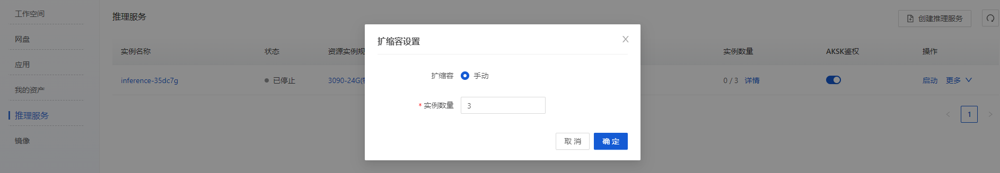

# 推理解决方案

## 1. 概述

平台提供了AI推理解决方案。点击控制台左侧导航栏中的“推理服务”，将会看到已经创建的推理服务列表。点击右上角创建按钮， 选择一种资源实例类型，可以购买按量计费的弹性资源，也可以选择已经购买的包年包月资源，之后设置推理服务的docker镜像， 设置对外暴露的端口，以及服务启动的脚本。推理服务的模型可以打包在镜像内，也可以选择模型市场上的模型，或者用户网盘中指定的模型文件，设置模型挂载的路径，点击创按钮，就可以启动一个推理服务实例。

## 2. 认证

推理服务默认会启动基于AKSK的签名认证机制，AKSK可以点击平台右上角的头像，进入设置页面，点击AKSK Tab进行查看

<figure><figcaption></figcaption></figure>

<figure><figcaption></figcaption></figure>

下面给出一段构建签名请求的例子代码：

```python
import requests
import json
import base64
import hashlib
import hmac
from datetime import datetime

HOST = "XXX"                                        #Change this to your HOST.
METHOD = "GET"                                                                          #Change this to your METHOD.
URL = "/"                                                                               #Change this to your URL
BODY = ""                                                                               #Change this to your BODY.
CREDENTIAL = ""                                                                         #Change this to your CREDENTIAL.
SECRET = ""                                                                             #Change this to your SECRET.

def sign_request(host,
                method,     # GET, PUT, POST, DELETE
                url,        # Path + Query
                body,       # Request body
                credential, # Access Key ID
                secret):    # Access Key Value
    verb = method.upper()
    utc_now = str(datetime.utcnow().strftime("%a, %d %b %Y %H:%M:%S ")) + "GMT"
    content_digest = hashlib.sha256(bytes(body, 'utf-8')).digest()
    content_hash = base64.b64encode(content_digest).decode('utf-8')
    # Signed Headers
    signed_headers = "date;host;x-ark-content-sha256"  # Semicolon separated header names
    # String-To-Sign
    string_to_sign = verb + '\n' + \
                    url + '\n' + \
                    utc_now + ';' + host + ';' + content_hash  # Semicolon separated SignedHeaders values
    decoded_secret = base64.b64decode(secret, validate=True)
    digest = hmac.new(decoded_secret, bytes(
        string_to_sign, 'utf-8'), hashlib.sha256).digest()
    # Signature
    signature = base64.b64encode(digest).decode('utf-8')
    # Result request headers
    return {
        "date": utc_now,
        "x-ark-content-sha256": content_hash,
        "Authorization": "HMAC-SHA256 Credential=" + credential + "&SignedHeaders=" + signed_headers + "&Signature=" + signature
    }
on
if __name__ == '__main__':
    headers = sign_request(HOST,
                        METHOD,
                        URL,
                        BODY,
                        CREDENTIAL,
                        SECRET)
    print(headers)
    resp = requests.get("https://"+HOST, headers=headers)
    print(resp.status_code)
```

如果需要关闭，可以在创建推理服务的高级配置中，选择关闭认证。关闭认证后，任何人都可以通过推理服务的Endpoint(请求地址)访问该服务。所以用户也可以通过创建关闭认证的推理服务，快速搭建一个简单的Web服务。

## 3. 手动扩缩容

推理服务提供手动扩缩容的功能。用户可以在推理服务列表中看到实例数量，点击数量后面的详情后，可以手动调整目标节点数及其配置。点击小笔头可以修改扩缩容配置，包括手动设置Pod的数量。

<figure><figcaption></figcaption></figure>

<figure><figcaption></figcaption></figure>

## 4. 例子

在快速开始的例子中，我们基于resnet34训练了一个5分类花卉的模型，这里我们想在平台上把这个模型构建一个推理服务。

### 4.1 工作空间调试

在工作空间内，创建一个infer目录，把刚才训练得到的模型权重文件，以及依赖的模型文件和分类文件拷贝进去

```bash
mkdir ～/infer
cd ~/infer
cp deep-learning-for-image-processing/pytorch_classification/Test5_resnet/model.py .
cp deep-learning-for-image-processing/pytorch_classification/Test5_resnet/class_indices.json .
cp deep-learning-for-image-processing/pytorch_classification/Test5_resnet/resNet34.pth flower-model.pth
```

然后参考deep-learning-for-image-processing/pytorch\_classification/Test5\_resnet/中的infer.py，在infer目录下编写一个flask版本的推理脚本infer.py如下：

```python
import torch
from PIL import Image
from torchvision import transforms
import matplotlib.pyplot as plt
from model import resnet34
from flask import Flask,request
import os,json
app = Flask(__name__)

@app.route("/flowers",methods=['POST'])
def main():
    data_transform = transforms.Compose(
        [transforms.Resize(256),
         transforms.CenterCrop(224),
         transforms.ToTensor(),
         transforms.Normalize([0.485, 0.456, 0.406], [0.229, 0.224, 0.225])])
    image = request.files.get('content')
    img = Image.open(image.stream)
    img = data_transform(img)
    img = torch.unsqueeze(img, dim=0)
    with torch.no_grad():
        # predict class
        output = torch.squeeze(model(img.to(device))).cpu()
        predict = torch.softmax(output, dim=0)
        predict_cla = torch.argmax(predict).numpy()
    print_res = "class: {}   prob: {:.3}".format(class_indict[str(predict_cla)],
                                                 predict[predict_cla].numpy())
    for i in range(len(predict)):
        print("class: {:10}   prob: {:.3}".format(class_indict[str(i)],
                                                  predict[i].numpy()))
    return class_indict[str(predict_cla)]
if __name__ == '__main__':
    device = torch.device("cuda:0" if torch.cuda.is_available() else "cpu")
    json_path = './class_indices.json'
    assert os.path.exists(json_path), "file: '{}' dose not exist.".format(json_path)
    with open(json_path, "r") as f:
        class_indict = json.load(f)
    model = resnet34(num_classes=5).to(device)
    weights_path = "./flower-model.pth"
    assert os.path.exists(weights_path), "file: '{}' dose not exist.".format(weights_path)
    model.load_state_dict(torch.load(weights_path, map_location=device))
    model.eval()
    app.run(host='0.0.0.0',port=27777)
```

然后我们编写一个本地测试客户端(infer-client-local.py)，实例代码如下。注意HOST是工作空间的调试地址（在工作空间的操作列中找到复制调试地址）

<figure><figcaption></figcaption></figure>

```python
import requests
from os.path import isfile, join
from os import listdir
import sys

HOST = XXXX
URL_PATH = '/flowers'

def local_run(files):
    response = requests.post(HOST+URL_PATH,files=files)
    data = response.text
    return data

if __name__ == '__main__':
    test_dirs = sys.argv[1]
    for image in listdir(test_dirs):
        image_path = join(test_dirs, image)
        if isfile(image_path):
            files= [('content', (image,open(image_path,'rb'),'image/jpeg'))]
            print(image,local_run(files))
```

我们创建一个imgs目录，随便复制几个测试图片到该目录，然后启动测试

```sh
mkdir imgs
cp ~/deep-learning-for-image-processing/data_set/flower_data/val/daisy/13901930939_a7733c03f0_n.jpg imgs/
cp ~/deep-learning-for-image-processing/data_set/flower_data/val/dandelion/13290033_ebd7c7abba_n.jpg imgs/
cp ~/deep-learning-for-image-processing/data_set/flower_data/val/roses/123128873_546b8b7355_n.jpg imgs/
cp ~/deep-learning-for-image-processing/data_set/flower_data/val/sunflowers/175638423_058c07afb9.jpg imgs/
cp ~/deep-learning-for-image-processing/data_set/flower_data/val/tulips/112334842_3ecf7585dd.jpg imgs/
python3 infer.py
python3 infer-client-local.py imgs/
```

可以看到正常输出：

```
user@lsp-ws:~/infer$ python3 infer-client-local.py imgs/
13901930939_a7733c03f0_n.jpg daisy
123128873_546b8b7355_n.jpg roses
13290033_ebd7c7abba_n.jpg dandelion
112334842_3ecf7585dd.jpg daisy
175638423_058c07afb9.jpg sunflowers
```

### 4.2 构建推理镜像并推送到平台镜像仓库

测试无误后，我们可以将推理服务打包成Docker镜像，推送到平台的镜像仓库。建议构建镜像时，从平台的公共镜像开始。推送命令参见控制台-镜像-查看推送命令。

下面是笔者在本地mac M1芯片上的操作步骤，供参考：

1. 从工作空间下载所需的文件

如果文件不大，可以在jupyter或者vscode中选中文件直接下载。如果文件较大，可以把文件复制到网盘后，使用网盘的下载命令行工具下载。这里我们直接从vscode下载所需的文件，即上一步中infer目录。

<figure><figcaption></figcaption></figure>

2. 撰写Dockerfile文件

问了减小风险，dockerfile 基于平台的pytorch公共镜像进行构建，下面给出参考的Dockerfile文件。

```docker
FROM reg.lanrui-ai.com/ark-public/pytorch@sha256:1ecf2f29cdc91c7ffc69589dc38139217944c0f42fff0e3994f8c57fda924ebe
RUN pip3 install flask
COPY flower-model.pth /ark/
COPY model.py /ark/
COPY class_indices.json /ark/
COPY infer.py /ark/
EXPOSE 5000
CMD ["python3","infer.py"]
```


3. Build镜像并推送

```bash
docker pull reg.lanrui-ai.com/ark-public/pytorch@sha256:1ecf2f29cdc91c7ffc69589dc38139217944c0f42fff0e3994f8c57fda924ebe
docker buildx build -f Dockerfile --platform=linux/amd64 -t demo-flower -f Dockerfile .
docker tag demo-flower reg.lanrui-ai.com/<username>/demo-flower
docker push reg.lanrui-ai.com/<username>/demo-flower
```

注意：

* 上面的\<username>是用户在平台的用户名，即平台右上角头像旁边显示的字符串（Hi后面的）
* 第一条命令是从平台上获取pytorch的官方镜像，可以参考下图，点击复制拉取命令获得
* 推送成功后，可以在平台的镜像-私有镜像中看到demo-flower镜像

<figure><figcaption></figcaption></figure>

### 4.3 创建推理服务

在控制台-推理服务，创建推理服务。选择一台GPU机器，设置如下（端口27777是因为我们代码中对外服务的端口是27777），点击创建。

<figure><figcaption></figcaption></figure>

### 4.4 编写客户端脚本

待推理服务启动后，我们在本地编写一个客户端脚本infer-client.py，和上面的本地测试客户端相比，加上了AKSK的鉴权机制。 注意填写脚本中HOST, AK和SK。其中HOST是推理服务的请求地址，AK和SK可以在平台右上角点击个人头像-设置-AKSK中获取。

<figure><figcaption></figcaption></figure>

```python
import requests
import base64,hashlib,hmac,os
from datetime import datetime
import time,threading,multiprocessing,os
from multiprocessing import Process,Pool
from os.path import isfile, join
from os import listdir
import sys

HOST = ''
AK = ''
SK = ''
URL_PATH = '/flowers'
def sign_request(host,
                 method,     # GET, PUT, POST, DELETE
                 url,        # Path + Query
                 body,       # Request body
                 credential, # Access Key ID
                 secret):    # Access Key Value
    verb = method.upper()
    utc_now = str(datetime.utcnow().strftime("%a, %d %b %Y %H:%M:%S ")) + "GMT"
    content_digest = hashlib.sha256(bytes(body, 'utf-8')).digest()
    content_hash = base64.b64encode(content_digest).decode('utf-8')
    signed_headers = "date;host;x-ark-content-sha256"  # Semicolon separated header names
    string_to_sign = verb + '\n' + \
                    url + '\n' + \
                    utc_now + ';' + host + ';' + content_hash  # Semicolon separated SignedHeaders values
    decoded_secret = base64.b64decode(secret, validate=True)
    digest = hmac.new(decoded_secret, bytes(
        string_to_sign, 'utf-8'), hashlib.sha256).digest()
    signature = base64.b64encode(digest).decode('utf-8')
    return {
        "date": utc_now,
        "x-ark-content-sha256": content_hash,
        "Authorization": "HMAC-SHA256 Credential=" + credential + "&SignedHeaders=" + signed_headers + "&Signature=" + signature
    }
def run(files):
    headers = None
    headers = sign_request(HOST.split('https://')[1],
                           "POST",
                           URL_PATH,
                           "",
                           AK,
                           SK)
    response = requests.post(HOST+URL_PATH,headers=headers,files=files)
    data = response.text
    return data

if __name__ == '__main__':
    test_dirs = sys.argv[1]
    for image in listdir(test_dirs):
        image_path = join(test_dirs, image)
        if isfile(image_path):
            files= [('content', (image,open(image_path,'rb'),'image/jpeg'))]
            print(image,run(files))
```

执行后可以看到成功了

```sh
python infer-client.py imgs
13290033_ebd7c7abba_n.jpg dandelion
175638423_058c07afb9.jpg sunflowers
123128873_546b8b7355_n.jpg roses
112334842_3ecf7585dd.jpg daisy
13901930939_a7733c03f0_n.jpg daisy
```

### 4.5 扩缩容

当前的推理服务只有一个实例，存在单点风险。我们可以扩容为两个节点。点击实例数量后面的详情，选择手动扩缩容， 修改实例数量为2，点击确定。

<figure><figcaption></figcaption></figure>

设置完成后，进入实例详情中，可以看到已经有两个实例了。等第二个实例启动后，我们可以用4.4的测试代码请求多次。在监控信息的日志里，可以看到请求被负载均衡到两个实例了。

<figure><figcaption></figcaption></figure>

<figure><figcaption></figcaption></figure>

<figure><figcaption></figcaption></figure>


